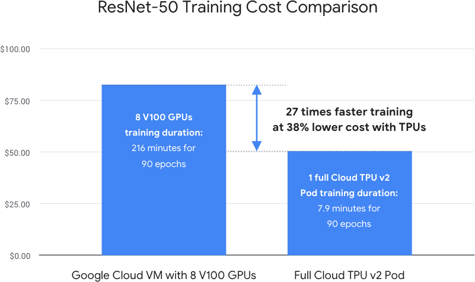

# 深度学习服务器调研
## GPU调研
 [源网页1](https://timdettmers.com/2019/04/03/which-gpu-for-deep-learning//)  
 [源网页2](https://lambdalabs.com/blog/best-gpu-tensorflow-2080-ti-vs-v100-vs-titan-v-vs-1080-ti-benchmark/?utm_source=google&utm_campaign=1721185907&utm_medium=search&utm_term=%2Bdettmers%20%2Bgpu&utm_content=335777608047&matchtype=b&adgroup=70115897640&feeditemid=&loc_interest_ms=&loc_physical_ms=9003503&network=g&device=c&devicemodel=&adposition=1t1&gclid=EAIaIQobChMI0YfIxMLk5QIVFJSzCh3bngpnEAAYASAAEgL9CPD_BwE)  
 [源网页3](https://www.quora.com/What-is-the-hardware-required-for-Reinforcement-Learning)  
- 参数选择（避免进行32位浮点运算）
&emsp;1. 卷积网络（视频处理）：张量核心>FLOPS>显存带宽>16位浮点计算能力
&emsp;2. Transformer（NLP）：张量核心>FLOPS>显存带宽>16位浮点计算能力
&emsp;3. RNN（NLP）：显存带宽>16位浮点计算能力>张量核心>FLOPS
&emsp;4. DRL：DRL更加需要的是CPU算力，很多研究者使用计算机集群
- 性能比较
1. RNN&CNN&transformer：这里的TPU并不是最新款，所以主要比较GPU，可以看到做NLP的话tesla V100和titan V并驾齐驱；

2. CNN：对于各种CNN模型，tesla V100都是毫无疑问的王者；

- 性价比比较：tesla V100虽然性能最强，但是单显卡性价比最低；RTX2060只是单显卡性价比高，但是四RTX2018Ti比八RTX2060更具性价比（价格相近）

## RAM调研
 [源网页1](https://timdettmers.com/2018/12/16/deep-learning-hardware-guide//)  
 [源网页2](https://medium.com/syncedreview/harvard-researchers-benchmark-tpu-gpu-cpu-for-deep-learning-3034a452958d)
- 时钟频率：更快的内存时钟频率并不会获得更快的深度学习速度
- 内存大小：必须至少与GPU显存大小相同，才能充分发挥GPU效果；对于CPU主导的运算，内存越大，能承受的模型规模也越大
## TPU调研
[源网页1](https://www.forbes.com/sites/moorinsights/2018/12/13/nvidia-wins-first-ai-benchmarks/#4984647ae4a2)  
[MLPerf](https://mlperf.org/training-results-0-6/)
- 与GPU比较
1. 哈佛的学者设计了一种包含CNN和RNN的paraDNN模型，用来测试TPU vs GPU vs CPU并发表了一篇论文。[链接](https://arxiv.org/pdf/1907.10701.pdf)
其归纳结果为下图，对于更大规模CNN和更大规模batch，TPU表现比GPU更好，但对于RNN和非典型网络，GPU不仅表现好而且有更好的灵活性。

谷歌的评测也证实对于大规模CNN，TPU训练速度更快这一点。

2. MLPerf评测：  
在MLPerf评测结果中，无论是单核还是多核，V100都有比TPU更快的速度。  
单GPU vs 单TPU

多GPU vs 多TPU

DGX-1 & intel & TPUv3：这张表需要注意的是加入了强化学习的跑分，可以看到在强化学习方面，intel的平台相当于三个英伟达的DGX-1。  

- 平台：目前只有Google cloud，也就是说只有云服务器方案
## AI芯片调研
[AI芯片列举](https://github.com/basicmi/AI-Chip)  
目前各厂商AI芯片及其平台主要服务于边缘设备或手机，如intel用于边缘推理的Movidius，英伟达用于自动驾驶的NVIDIA DRIVE™ PX，高通用在手机上的Snapdragon 855。  
IBM提出了一种类脑芯片，拥有4096个神经元核心进行计算，可以拥有很强的算力，但是对于研究人员开发算法，由于支撑软件尚不成熟，还不算友好。  
寒武纪的MLU270对标英伟达的Tesla T4，并且支持Tensoflow和Caffe，但是相对来讲开发难度也许不适合实验室所有人。  
依图科技的AI芯片对于计算机视觉和智能语音有较好支持，但是DRL不在其应用场景范围内。  

## FPGA调研
[intel FPGA](https://www.intel.com/content/www/us/en/storage/products/programmable/applications/machine-learning.html)  
[Xilinx FPGA](https://www.xilinx.com/news/press/2018/xilinx-launches-the-world-s-fastest-data-center-and-ai-accelerator-cards.html)  
[Microsoft FPGA](https://www.microsoft.com/en-us/research/project/project-catapult/)  
[Amazon FPGA](https://amazonaws-china.com/cn/ec2/instance-types/f1/?nc1=h_ls)  
[tencent FPGA](https://cloud.tencent.com/product/fpga)  
[Huawei FPGA](https://www.huaweicloud.com/product/fcs.html)  
[Kortuq](http://www.kortiq.com/)  
[Achronix](https://www.achronix.com/)  

1. intel：目前只有CNN的加速，通过FPGA和OpenCL。其官网列举的应用场景并没有NLP和DRL。  

2. Xilinx：赛灵思号称部署了世界上最快的数据中心和AI加速卡。  

3. Microsoft：  

4. Amazon：  

5. 腾讯云：  

6. 华为云：  
7. TeraDeep：初创公司，没有官网  

8. Kortiq：是一家提供AI ip的公司，提供CNN，智能翻译，智能评估系统的ip，也有自己的模型剪枝库。基于Xilinx的Zynq和MPSoC系列片上系统（这两个系列是Xilinx的FPGA与armCPU共存在一块芯片的产品，也是Xilinx目前的主打产品）。  

9. Achronix：7nm制程做出了比xilinx还要强大的可专门服务于AI的FPGA，但是上层软件库并没有跟上。  
## CPU调研
[跑分](https://dawn.cs.stanford.edu/benchmark/ImageNet/train.html)  
[源网页2](https://blog.inten.to/cpu-hardware-for-deep-learning-b91f53cb18af)  
[源网页3](https://en.wikipedia.org/wiki/AVX-512#CPUs_with_AVX-512)
在斯坦福的一个指定任务训练竞赛中，intel的36核心Xeon Platinum达到了可以和TPU相提并论的训练速度，是CPU中的佼佼者。（但是部署于Amazon EC2）  
网页2列举了一些可用的深度学习服务器CPU选择，发展最成熟的是intel，在其目前的Xeon Phi和skylake-X系列支持AVX-512指令，该指令可加快高负荷量运算。在今年十月，intel推出了专用于神经计算的AVX512-VNNI指令集，Xeon Platinum 2代均支持该指令集。  
网页3列举了支持AVX512的CPU。  
AMD的CPU支持到AVX-256，但是不支持更大规模向量运算加速。  
- 上面各跑分榜单中列举的CPU包括：  
&emsp;1. XEON® PLATINUM 8260L：主频2.4GHz，睿频3.9GHz，24核心48线程，缓存35.75MB，功耗165W，价格约12599美元（数据上同样性能的8260约7507.17-8226.34美元）。
[XEON PLATINUM 8260链接](https://www.intel.com/content/www/us/en/products/processors/xeon/scalable/platinum-processors/platinum-8260.html)  
&emsp;2. Amazon AWS EC2中包含的CPU：采用的基本是定制Cascade架构处理器，36核心，主频3.6GHz，睿频3.9GHz。跑分中用的c5.xlarge使用价格每小时 0.17 USD，如果一年一直在跑每年1489.2USD。
[AWS ec2](https://amazonaws-china.com/cn/ec2/)  
>目前实验室的CPU：
>i7-6850K：主频3.6GHz，六核心12线程，功耗140W；
>2*Xeon E5-2603v4：主频1.7GHz，12核心12线程，单CPU功耗85W；

- Xeon 其它性能较强CPU(只列举支持AVX-512的CPU)：
>以下前两个系列属于Xeon Scalable，一块CPU使用多块GPU；X系列单CPU最具性价比，但是一块CPU只能接一块GPU

Platinum系列：  
共性：最大支持1TB 2933MHz内存，前三者6内存通道，PCIE3.0。后二者12内存通道。  
&emsp;1. 8274：主频3.2GHz，睿频4.0GHz，24核心48线程，缓存35.75MB，功耗240W  
&emsp;2. 8276：主频2.2GHz，睿频4.0GHz，28核心56线程，缓存38.5MB，功耗165W(13717.57美元)  
&emsp;3. 8284：主频3.0GHz，睿频4.0GHz，28核心56线程，缓存38.5MB，功耗240W()  
&emsp;4. 9242：主频2.3GHz，睿频3.8GHz，48核心96线程，缓存71.5MB，功耗350W()  
&emsp;5. 9282：主频2.6GHz，睿频3.8GHz，56核心112线程，缓存77MB，功耗400W()  
Gold系列：  
&emsp;1. 6254：主频3.1GHz，睿频4.0GHz，18核心36线程，缓存24.75MB，功耗200W(4037.54美元)  
&emsp;2. 6210U&6248：主频2.5GHz，睿频3.9GHz，20核心40线程，缓存27.5MB，功耗150W(2554.23美元)(3403.49美元)  
&emsp;3. 6238：主频2.1GHz，睿频3.7GHz，22核心44线程，缓存30.25MB，功耗140W(3045美元)  
&emsp;4. 6212U：主频2.4GHz，睿频3.9GHz，24核心48线程，缓存35.75MB，功耗165W(2239.70美元)  
W系列：  
&emsp;1. 2295：主频3.0GHz，睿频4.6GHz，18核心36线程，缓存24.75MB，功耗165W()  
&emsp;2. 3175X：主频3.1GHz，睿频3.8GHz，28核心56线程，缓存38.5MB，功耗255W(3299.99美元)  
&emsp;3. 3265：主频2.7GHz，睿频4.4GHz，24核心48线程，缓存33MB，功耗205W(3434.09美元)  
## 价格调研
1. Google Cloud(TPU)：

2. 服务器：
>调研方式：在一些服务器公司官网进行配置，查看定价

